..
   Copyright 2021 AI Singapore. All rights reserved.

   Licensed under the Apache License, Version 2.0 (the "License"); you may not use this file except in compliance with
   the License. You may obtain a copy of the License at

      http://www.apache.org/licenses/LICENSE-2.0

   Unless required by applicable law or agreed to in writing, software distributed under the License is distributed on
   an "AS IS" BASIS, WITHOUT WARRANTIES OR CONDITIONS OF ANY KIND, either express or implied. See the License for the
   specific language governing permissions and limitations under the License.

Feature Introduction
=====================
Currently there are 5 core feature components covered under **Rarity** gap analysis report. These components will be tappout respectively as a new `tab` in the dash 
web application.

General Metrics
----------------
- Component tab that covers general metrics used to evaluate model performance.
- On ``Regression`` task, metrics covered as follows

   - scatter plots of Prediction vs Actual
   - scatter plots of Offset vs Prediction
   - Mean Absolute Error
   - Mean Squared Error
   - Root Mean Squared Error
   - R Squared

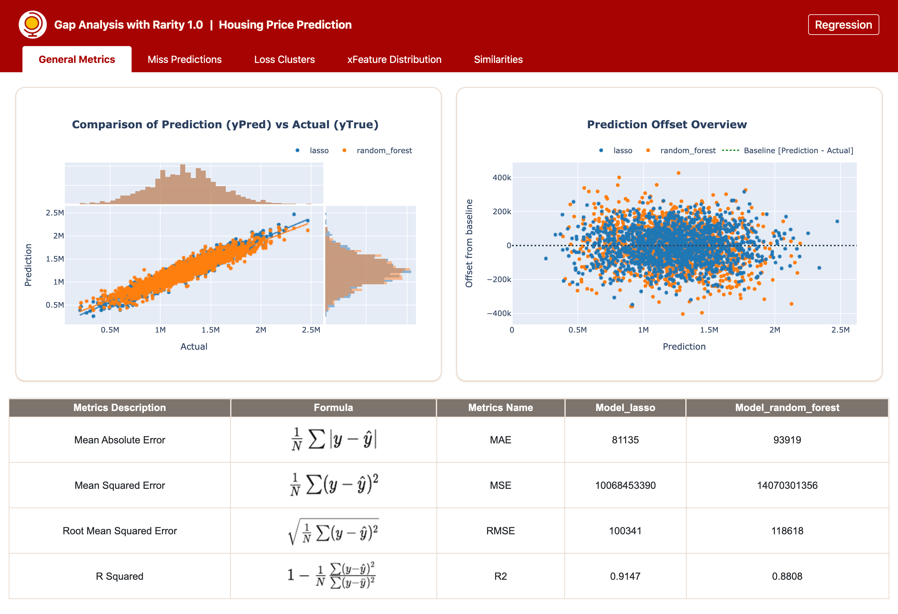

- On ``Classifciation`` task, metrics covered as follows

   - Confustion Matrix
   - Classification Report
   - ROC-AUC curve
   - Precision-Recall curve

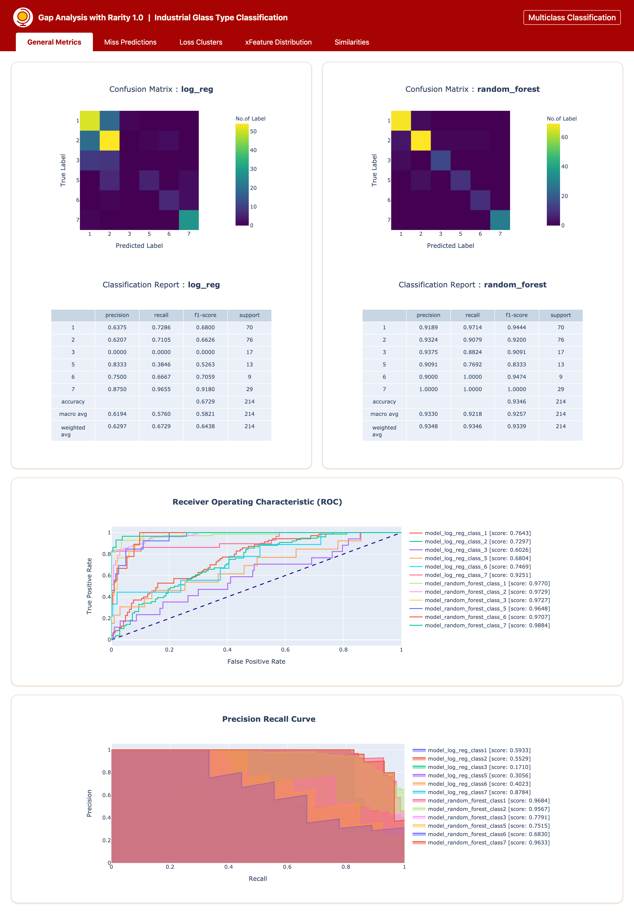

Miss Predictions
-----------------
- Component tab that presents miss predictions scatter plot by index number
- User can select data point of interest on the plot to trigger the associated full features and prediction values for further inspection of raw data

``Regression`` example

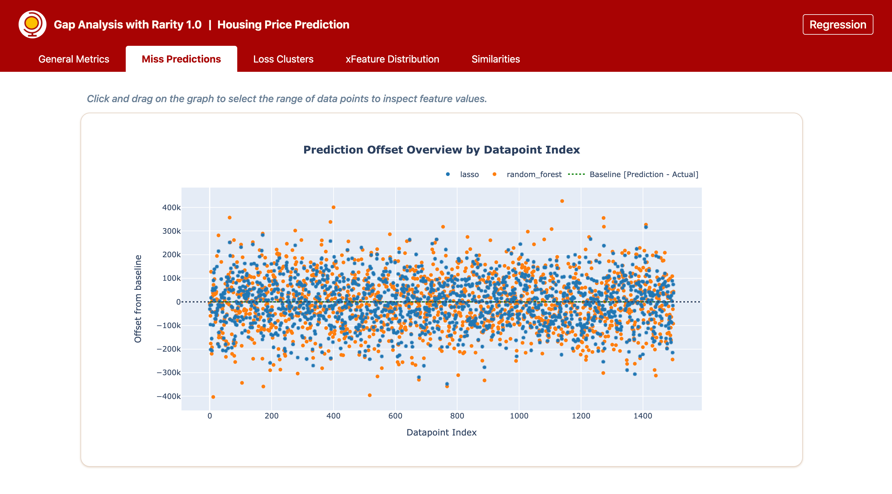
   
.. |misspred-reg-filtered| image:: imgs/misspred-reg-filtered.png
   :align: top
   :width: 42%

|misspred-reg|  ==>>  |misspred-reg-filtered|

``Classifciation`` example

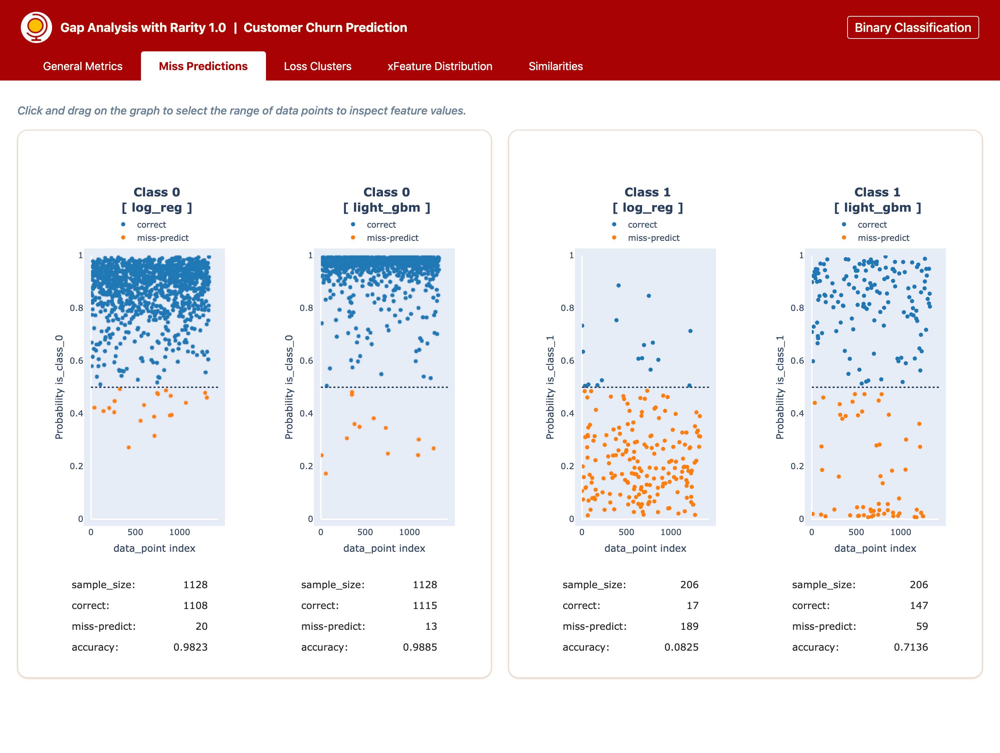
   
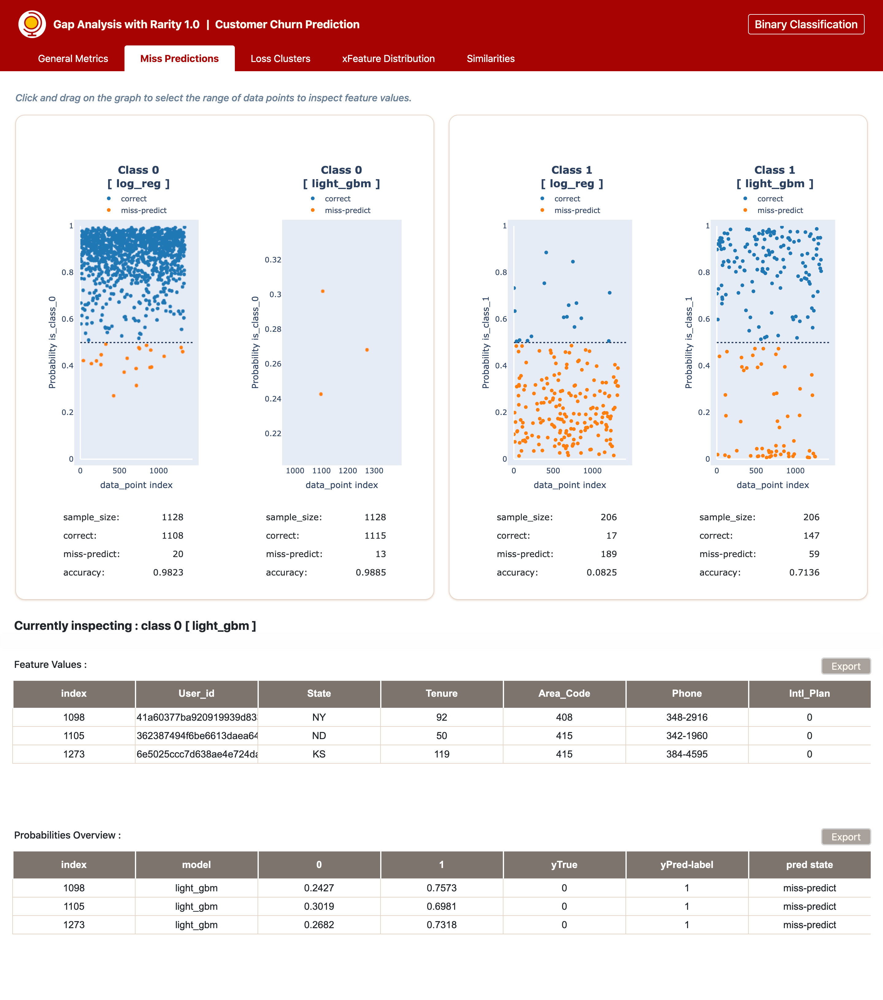

|misspred-cls|  ==>>  |misspred-cls-filtered|

Loss Clusters
--------------
- Component tab that covers clustering info on offset values (on regression) / logloss (on classification) using :class:`~transformerssklearn.cluster.KMeans` to provide insights on which cluster group to focus / pioritize
- A figure displaying clustering group based on elbow method is also attached to ease user finding the optimum number of cluster to form
- Flexible parameter on logarithmic methods is available to allow user to select logarithmic metrics of choice
- User can specifiy no. of cluster to plot and zoom in certain data point of interest to inspect the associated full features and prediction values

Example of ``Loss Clusters`` feature tab 

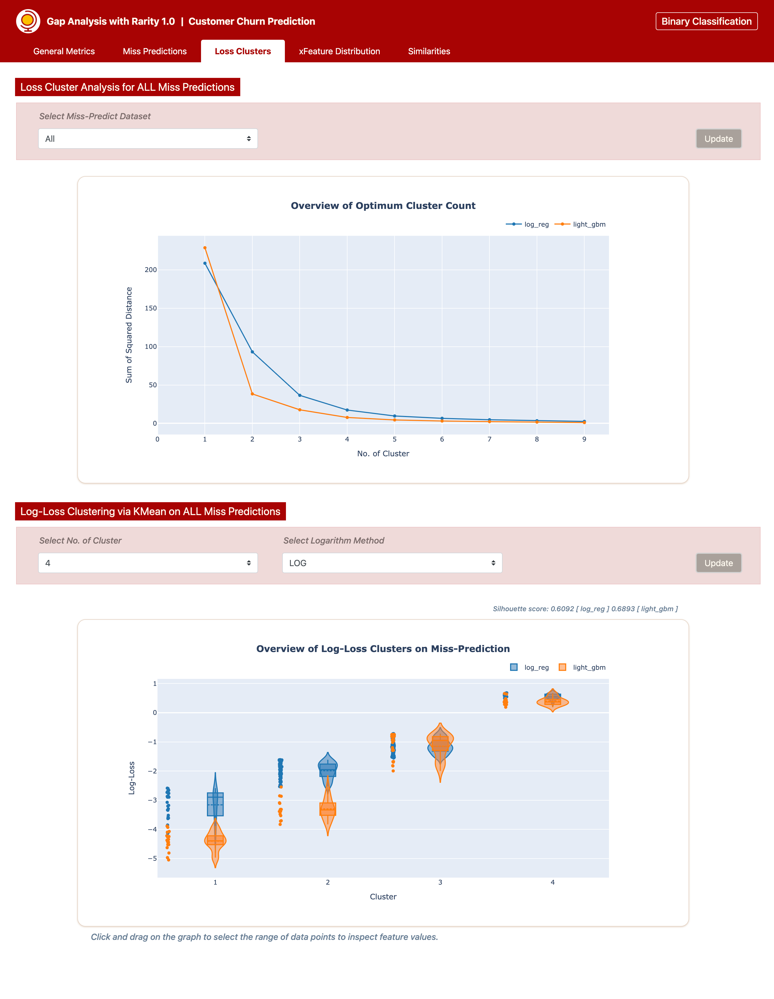

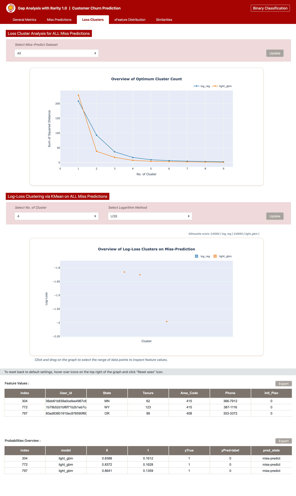

|loss-clusters|  ==>>  |loss-clusters-filtered|

xFeature Distribution
----------------------
- Component tab that displays distribution plots based on kl-divergence score
- Flexible parameters are included to enable 

   - exclusion of single feature or several features from being considered into the calculation of distribution ranking and display
   - selection to display top-n / bottom-n / both
   - slicing of dataframe to the range of interest
   - exclusively display specific feature to inspect its distribution

Example of ``xFeature Distribution`` tab for ``regression`` and ``classification``

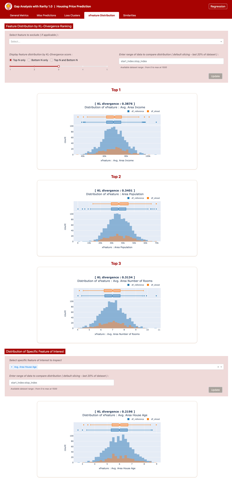
   
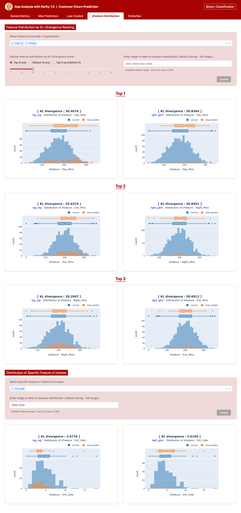

|feat-dist-reg|  <==>  |feat-dist-cls|

Similarities ( +CounterFactuals )
---------------------------------
- Component tab that contains tabulated info listing top-n data points based on similarities in features with reference to data index specified by user
- Flexible parameters are included to enable

   - user to define specific data index to inspect feature similarities
   - selection to display upto top-10 data points that show similarities based on calculated distance score
   - exclusion of specific single feature or several features from being considered in the calculation of similarities

``Regression`` example

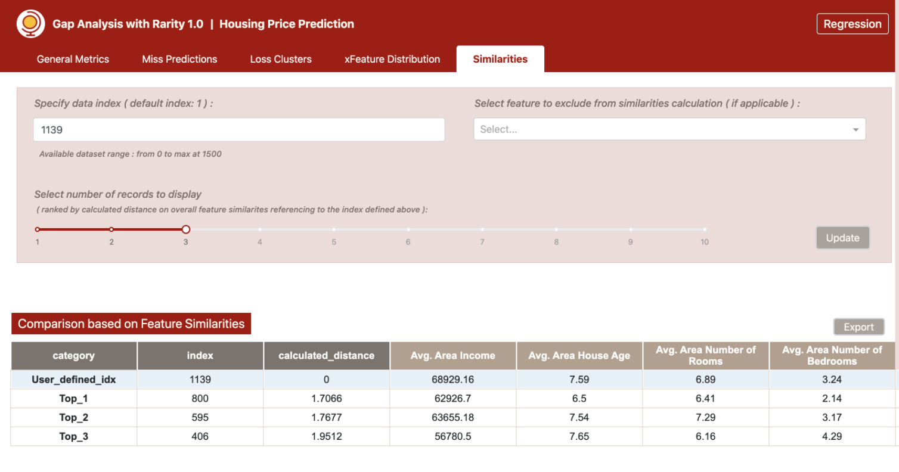

- Additional **Counter-Factuals** is also tabulated for classification task to better compare data points with most similar features but show different prediction outcomes. 

``Classification`` example with tabulated ``CounterFactuals`` 

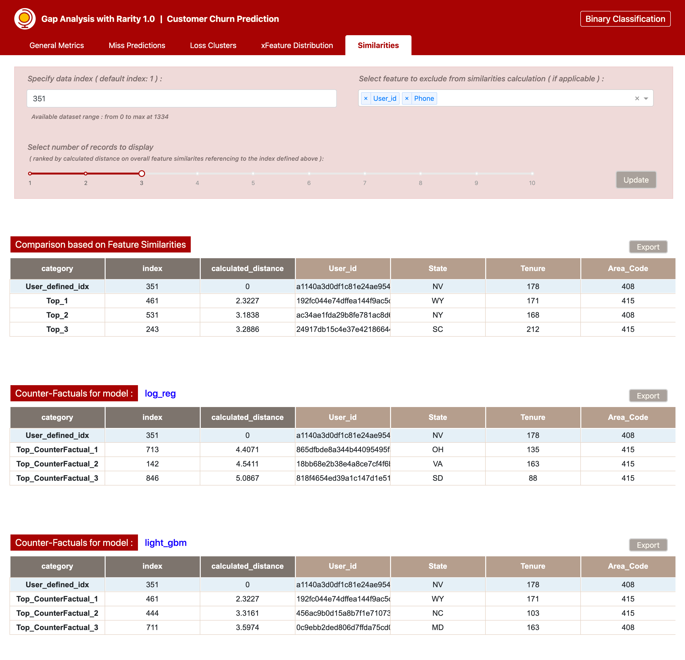
